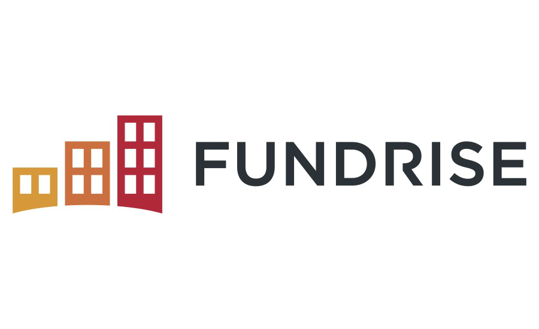

# Homework_1_Fundrise
Fundrise Case Study
# HOMEWORK-1
Homework #1 for research on a FinTech company
# Here is the Case Study

# FUNDRISE E-REIT CASE STUDY

## Overview and Origin

**Name of company**
*Fundrise

**When was the company incorporated?**

*2012

**Who are the founders of the company?**

*Benjamin Miller, Brandon Jenkins, Daniel Miller, Kenny Shin

**How did the idea for the company (or project) come about?**

*To help individuals assist in development and ownership of real estate in their city through equity crowdfunded private ownership initatives. Initially, the platform was solely for accredited investors (individuals whose net worth exceed $1,000,000 or have income over a certain threshold). However, Fundrise has opened up it's platform to a wider audience due to recent Acts passed by the SEC. 

**How is the company funded? How much funding have they received?**

*The company is a private entity; they have raised $55mm through 7 funding rounds. 

## Business Activities:

**What specific financial problem is the company or project trying to solve?**

*Fundrise is trying to allow everyday consumers access the real estate market through their "eREIT" technology. Fundrise allows users to deposit a sum of money (minimum of $500), users choose a growth profile, and then Fundrise allocates the users funds to a variety of real estate investments. Fundrise offers competitive fees, offers a simple user interface, and has provided an annualized 9% return the past 4 years.

*Weaknesses of Fundrise are liquidity (individuals must pay a early redemption fee before 5 years) and only four portfolio options to choose from. 

**Who is the company's intended customer?  Is there any information about the market size of this set of customers?**

*The Company's intended customers are individuals looking to diversify into the real estate market who are looking for a sleek graphic interface and diversification. Fundrise also offers Investment Retirement Accounts as well. Their low minimum ($500) helps cater to younger audiences; however, their penalties for early withdrawal may disway users from joining the platform. 

*Fundrise offers "Advanced Strategies" for individuals who invest more than $10,000 into their platform. These "Advanced Strategies" offer further diversification and different investment strategies. For younger audiences, this amount of $10,000 may be difficult to capture. 

What solution does this company offer that their competitors do not or cannot offer? (What is the unfair advantage they utilize?)
One of Fundrise's strongest competitive advantages was being a pioneer in the usage of SEC Regulation A+. This regulation made it more accessible for non-accredited investors to invest in these platforms. Previously, Fundrise only accepted accredited investors; but opened up to the masses once the SEC passed this regulation in 2016.

**Which technologies are they currently using, and how are they implementing them? (This may take a little bit of sleuthing–– you may want to search the company’s engineering blog or use sites like Stackshare to find this information.)**

*Fundrise utilizes technology in a few ways. Through it's propietary model, Fundrise vets multiple real estate opportunities; and only invests in a small % of them (from which users' funds are allocated). Fundrise also partners up with distinct tax entities to provide schedule K1's to all investors; this is motly an automated process. Finally, Fundrise hires multiple engineers to maintain the app, website and productivity of the company. 

## Landscape:

**What domain of the financial industry is the company in?**

*Investments, specifically in the real estate technology sector. 

**What have been the major trends and innovations of this domain over the last 5-10 years?**

*One of the biggest innovations in this market was the introduction of Regulation A+ from the SEC. Historically, investors were only allowed to invest in real estate through REITS. Equity crowd funded REITs allow further diversification of funds; while also offering a more simplified interface. 

**What are the other major companies in this domain?**

*There have been more estate crowdfunding competitors; including Realty Mogul, RealtyShares, and Patch of Land.

## Results

**What has been the business impact of this company so far?**

*Fundrise is the largest equity crowdfunding real estate platform. From their website, they have over 130,000 active investors, with over $4.9bn in transactions completed within the real estate market. I believe that they have provided investors with a new way to invest in real estate; and in the future, more investors will utilize eREITs to diversify their investments. 

**What are some of the core metrics that companies in this domain use to measure success? How is your company performing, based on these metrics?**

*Some metrics we could use to compare success include minimum investment requirement, percentage returns, and net dividends earned by investors.

*For Fundrise, these numebrs are $500, 9%, and $79million
*For Realty Mogul, these numbers are $1,000, 8%, and $55million
*For RealtyShares, these numbers are $5,000, 7%, and $59million.

**How is your company performing relative to competitors in the same domain?**

*From the numbers listed above, Fundrise seems to be outperforming it's competitors. One could argue though; that with higher requirements of funding, there may be better services provided through more investment opportunities, more opportunities for liquidiation, and a more sophisticated user interface. 

## Recommendations

**If you were to advise the company, what products or services would you suggest they offer? (This could be something that a competitor offers, or use your imagination!)**

*I would recommend Fundrise to offer more focused portfolio strategies. On Fundrise, portfolios are made up of investments rated from A - D. A investments are relatively safe with lower return, while D investments are riskier but possess higher return possibilities. I believe investors should be able to choose a letter that they want to invest in rather than choosing a blanket portfolio made up of A - D investments. 

**Why do you think that offering this product or service would benefit the company?**

*Allowing this would allow further diversification and customization for investors. Being an active investor, I would like this opportunity. If we are slowly coming out of an economic downturn, I would like the ability to take on more risk in order to potentially realize a higher return. While simultaneously, I would want to hedge my real estate portfolio towards safer investments if we are reaching a high point in the economic cycle. 

**What technologies would this additional product or service utilize?**

*I believe it would just use the technology Fundrise already offers. As an aside, I believe that Fundrise would have better usage for their efforts in marketing intiatives to attract a wider customer base. 

Sources:
Fundrise (https://fundrise.com/)
Fundrise Review (https://idealrei.com/blog/fundrise-review)
SEC (https://www.sec.gov/info/smallbus/secg/regulation-a-amendments-secg.shtml)
Fundrise Competitors (https://www.crowdcrux.com/alternatives-to-fundrise/)
Crunchbase (https://www.crunchbase.com/organization/fundrise)
